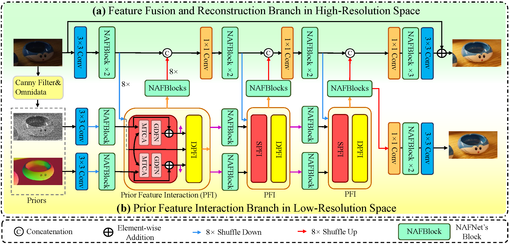

# UHDDIP: Ultra-High-Definition Restoration: New Benchmarks and A Dual Interaction Prior-Driven Solution

## Our proposed UHD-Snow dataset and UHD-Rain dataset

| Download Link | Description | 
|:-----: |:-----: |
| Google Drive (https://drive.google.com/drive/u/1/folders/1LaQvEBdjH5MwTwkfCZh3UJUGl8mYfvke?hl=zh_CN)) | A total of 3000 pairs for training and 200 pairs for testing. |

## UHDDIP Framework

## Requirements
- CUDA 10.1 (or later)
- Python 3.9 (or later)
- Pytorch 1.8.1 (or later)
- Torchvision 0.19
- OpenCV 4.7.0
- tensorboard, skimage, scipy, lmdb, tqdm, yaml, einops, natsort

## Training

## Testing

## Pretrain models and visual results
<table>
  <tr>
    <th align="center">Task</th>
    <th align="center">Model</th>
    <th align="center">Visual Results</th>
  </tr>
  <tr>
    <td align="center">UHD LLIE</td>
    <td align="center"><a href="https://drive.google.com/drive/u/0/folders/17AXniLhNqo5fu1xaCG8TgLRDJZaMQIGT">Download</a></td>
    <td align="center"><a href="https://drive.google.com/drive/u/0/folders/15ku_UDp1_5Uht6IZvs8Lol8A4-oJEMiv">Download</a></td>
  </tr>
  <tr>
    <td align="center">UHD Desnowing</td>
    <td align="center"><a href="https://drive.google.com/drive/u/0/folders/1-cJCwCmvNq3gPmnO9CMn2Gbddsd8mRN0">Download</a></td>
    <td align="center"><a href="https://drive.google.com/drive/u/0/folders/15ku_UDp1_5Uht6IZvs8Lol8A4-oJEMiv">Download</a></td>
  </tr>
  <tr>
     <td align="center">UHD Deraining</td>
    <td align="center"><a href="https://drive.google.com/drive/u/0/folders/1jELitPGwzcYH8E_3rsCLTLmvhWuCTGGS">Download</a></td>
    <td align="center"><a href="https://drive.google.com/drive/u/0/folders/15ku_UDp1_5Uht6IZvs8Lol8A4-oJEMiv">Download</a></td>
  </tr>
</table>

<strong>UHD Image LLIE</strong> (click to expand) 

 

<strong>Image Deblurring</strong> (click to expand) 

<strong>Real Image Denoising</strong> (click to expand) 

