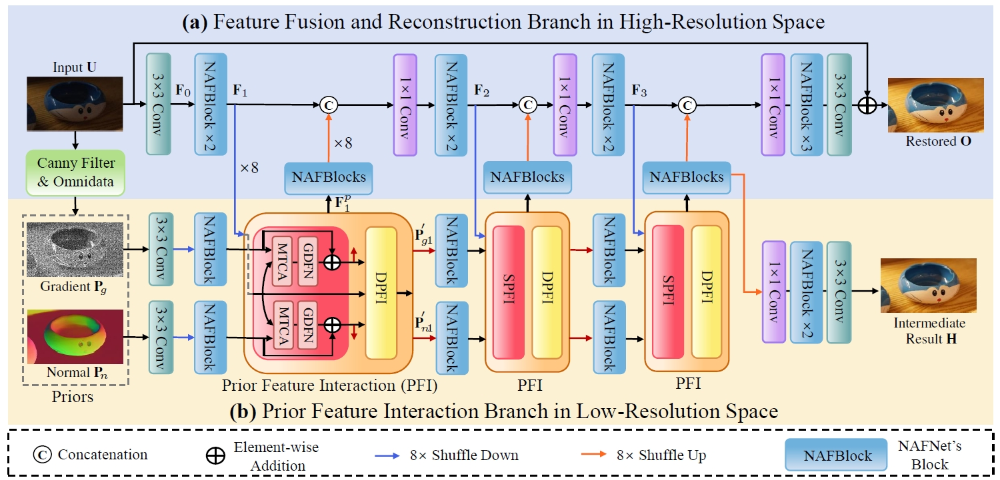

# UHDDIP: Ultra-High-Definition Restoration: New Benchmarks and A Dual Interaction Prior-Driven Solution

## Our proposed UHD-Snow dataset and UHD-Rain dataset

| Download Link | Description | 
|:-----: |:-----: |
| Google Drive (https://drive.google.com/drive/u/1/folders/1LaQvEBdjH5MwTwkfCZh3UJUGl8mYfvke?hl=zh_CN)) | A total of 3000 pairs for training and 200 pairs for testing. |

## UHDDIP Framework


## Requirements
- CUDA 10.1 (or later)
- Python 3.9 (or later)
- Pytorch 1.8.1 (or later)
- Torchvision 0.19
- OpenCV 4.7.0
- tensorboard, skimage, scipy, lmdb, tqdm, yaml, einops, natsort
  
## Data preparation

1. Please download the following datasets:

| Task | Training dataset | Testing dataset |
|:-----: |:-----: |:-----: |
|UHD LLIE| [UHD_LL](https://drive.google.com/drive/folders/17ppzNdPzLbx0htrBguWpatIXVQDs_v4O) (2000) |[UHD_LL](https://drive.google.com/drive/folders/1CjTvAfXZlbR8V-wIeGquzE1JNULCkqmv) (150)|
|UHD Desnowing| [UHD_Snow](https://drive.google.com/drive/u/1/folders/1A2bTIqlYATCRdh_BEg8VKXZ3_HojR1Kj?hl=zh_CN) (3000) | [UHD_Snow](https://drive.google.com/drive/u/1/folders/19WyL8lYSNE-TUmOyqMr7JA6PZVtjt_1G?hl=zh_CN) (200)|
|UHD Deraining| [UHD_Rain](https://drive.google.com/drive/u/1/folders/1mitkdAJoVDgadl_Qtwgp8nvSPeKF3qZD?hl=zh_CN) (3000) | [UHD_Rain](https://drive.google.com/drive/u/1/folders/1mitkdAJoVDgadl_Qtwgp8nvSPeKF3qZD?hl=zh_CN) (200)|

2. To obtain the normal prior images, all training data and testing data are processed through [Omnidata](https://github.com/EPFL-VILAB/omnidata), and the obtained normal prior images are placed under the same path as the corresponding input image and GT image above.

## Training

1. To train UHD IILE model,  modify the path where the UHD_LL dataset (including input, gt, normal) is located in the /src/Options/train_UHDDIP.yml, then run

    ```
    cd UHDDIP
    python -m torch.distributed.launch --nproc_per_node=2 --master_port=4321 basicsr/train.py -opt src/Options/train_UHDDIP.yml  --launcher pytorch
    ```
    
2. To train UHD desnowing model,  modify the path where the UHD_Snow dataset (including input, gt, normal) is located in the /src/Options/train_UHDDIP.yml, then run

    ```
    cd UHDDIP
    python -m torch.distributed.launch --nproc_per_node=2 --master_port=4321 basicsr/train.py -opt src/Options/train_UHDDIP.yml  --launcher pytorch
    ```

1. To train UHD deraining model,  modify the path where the UHD_Rain dataset (including input, gt, normal)  is located in the /src/Options/train_UHDDIP.yml, then run

    ```
    cd UHDDIP
    python -m torch.distributed.launch --nproc_per_node=2 --master_port=4321 basicsr/train.py -opt src/Options/train_UHDDIP.yml  --launcher pytorch
    ```

## Testing

1. Download all pre-trained models and place them in `./pretrained_models/`

2. Testing

    ```
    cd src
    python test_uhd.py
    ```

4. Calculating PSNR/SSIM/LPIPS scores, run

    ```
    python calculate_psnr_ssim.py
    ```

## Pre-trained models and visual results
<table>
  <tr>
    <th align="center">Task</th>
    <th align="center">Model</th>
    <th align="center">Visual Results</th>
  </tr>
  <tr>
    <td align="center">UHD LLIE</td>
    <td align="center"><a href="https://drive.google.com/drive/u/0/folders/17AXniLhNqo5fu1xaCG8TgLRDJZaMQIGT">Download</a></td>
    <td align="center"><a href="https://drive.google.com/drive/u/0/folders/15ku_UDp1_5Uht6IZvs8Lol8A4-oJEMiv">Download</a></td>
  </tr>
  <tr>
    <td align="center">UHD Desnowing</td>
    <td align="center"><a href="https://drive.google.com/drive/u/0/folders/1-cJCwCmvNq3gPmnO9CMn2Gbddsd8mRN0">Download</a></td>
    <td align="center"><a href="https://drive.google.com/drive/u/0/folders/15ku_UDp1_5Uht6IZvs8Lol8A4-oJEMiv">Download</a></td>
  </tr>
  <tr>
     <td align="center">UHD Deraining</td>
    <td align="center"><a href="https://drive.google.com/drive/u/0/folders/1jELitPGwzcYH8E_3rsCLTLmvhWuCTGGS">Download</a></td>
    <td align="center"><a href="https://drive.google.com/drive/u/0/folders/15ku_UDp1_5Uht6IZvs8Lol8A4-oJEMiv">Download</a></td>
  </tr>
</table>

<details>
<summary><strong>UHD Image LLIE</strong> (click to expand) </summary>

<p align="center"></p> 

</details>

<details>
<summary><strong>UHD Image Desnowing</strong> (click to expand) </summary>

<p align="center"></p>
<p align="center"></p>
</details>

<details>
<summary><strong>UHD Image Deraining</strong> (click to expand) </summary>

<p align="center"></p>
<p align="center"></p>
</details>

